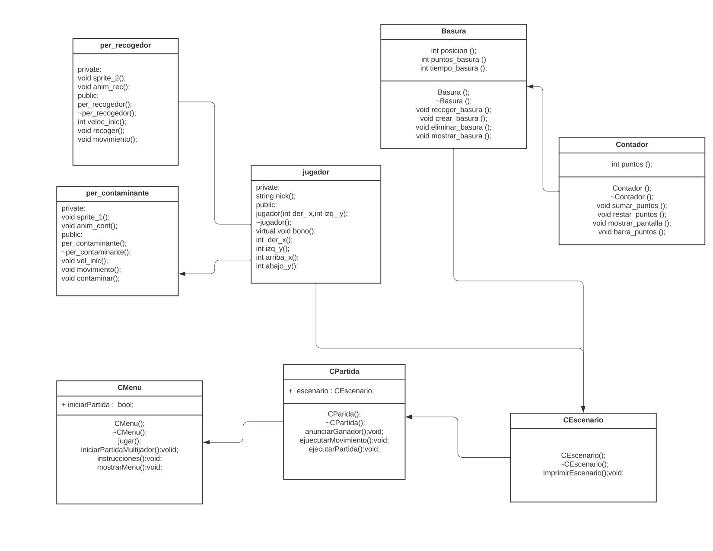
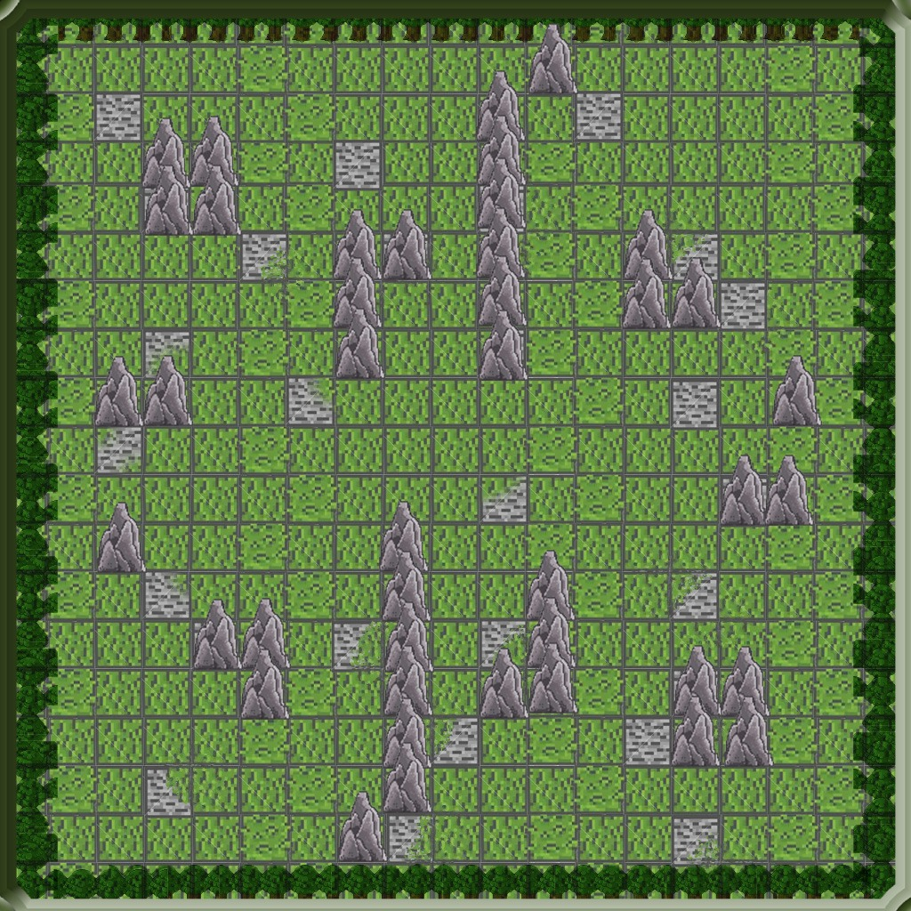
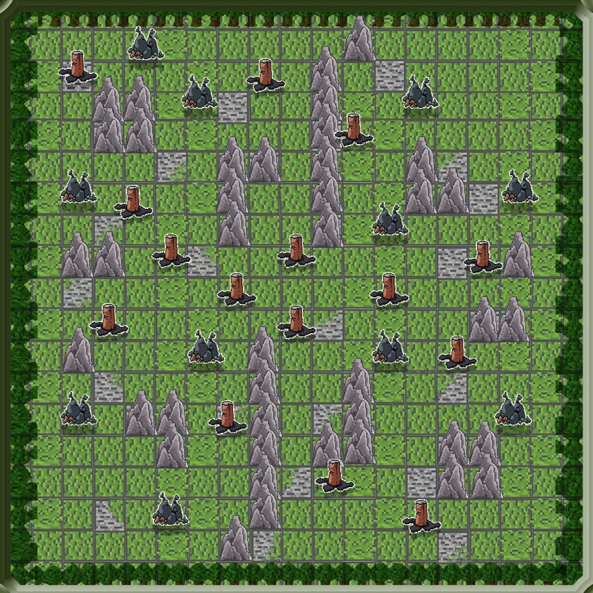
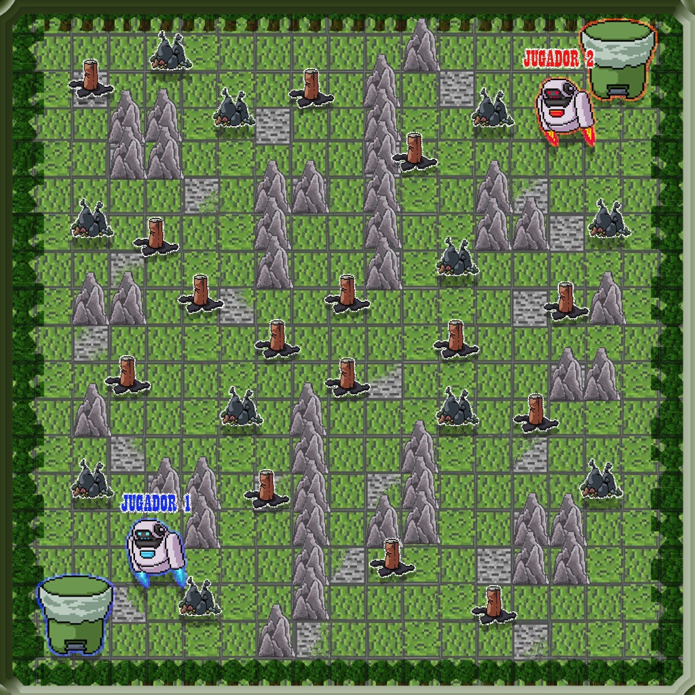
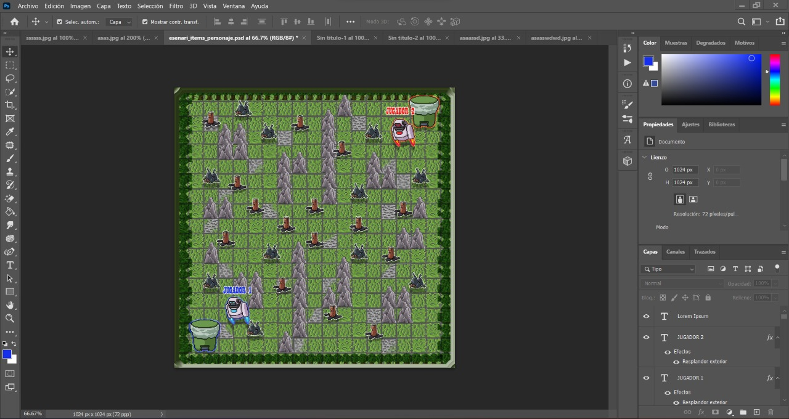

# Proyecto Final CCII

## ¡No tires la basura!

Un juego multijugador local donde los protagonistas buscan limpiar diferentes
lugares ensuciados por otros niños, pero por aquella tarea recibirán un pago
de sus vecinos por lo que estos buscan estropearse uno al otro para ganar más
dinero.

## Avances

~ Por el momento no hay avances ~

## Galería

